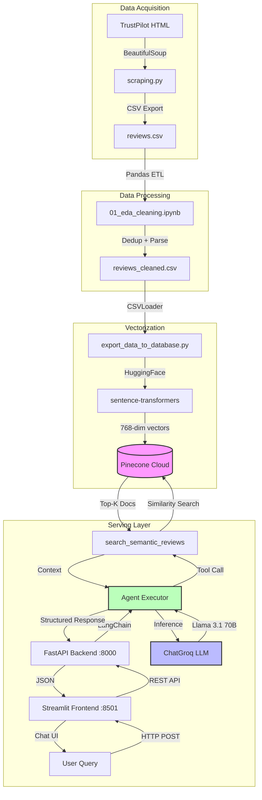

# Samsung Reviews NLP Analyzer

[](https://github.com/jarzeckil/samsung-review-nlp-analyzer/actions/workflows/ci.yaml)

[](https://github.com/astral-sh/uv)
[](https://python.org)
[](#)
[](#)
[](#)
[](#)

## Summary

Production-grade RAG system for semantic analysis of Samsung customer reviews scraped from TrustPilot. Implements agentic AI with tool-using LLMs to provide structured insights into review sentiment, feature requests, and customer pain points. Built for low-latency query-response cycles using vector similarity search over embedded review corpus.

**Problem**: Manual analysis of unstructured customer feedback at scale is infeasible. Traditional keyword search fails to capture semantic similarity.

**Solution**: Pipeline: web scraping → data cleaning → vectorization → conversational AI interface. Groq-powered LLM with ReAct-style tool use retrieves contextually relevant reviews from Pinecone vector store, enabling natural language queries over 180 cleaned reviews.

**Business Impact**: Reduces time-to-insight from hours to seconds. Enables product teams to query review data conversationally without SQL or manual filtering.

## System Architecture



**Data Flow**: Web scraping → Pandas cleaning → Vector embedding → Pinecone storage → Semantic retrieval → LLM synthesis → REST API → Chat UI

## Core Technologies

| Component | Technology                        | Justification                                                                                                            |
|----------|-----------------------------------|--------------------------------------------------------------------------------------------------------------------------|
| **API** | FastAPI 0.135+ / Uvicorn          | Asynchronous ASGI server with automatic OpenAPI docs, native async/await support for non-blocking I/O during LLM inference |
| **LLM Provider** | Groq (Llama 3.1 70B)              | Sub-second inference latency.                                                                                            |
| **RAG Framework** | LangChain 1.2+                    | Production-ready agent orchestration with tool use, standardized vector store abstractions, prompt management            |
| **Vector Database** | Pinecone                          | Managed service with sub-50ms similarity search, metadata filtering, horizontal scalability                |
| **Embeddings** | HuggingFace sentence-transformers | Open-source multilingual embeddings (768-dim), CPU-optimized, offline inference support                                  |
| **Frontend** | Streamlit 1.40+                   | Rapid prototyping of conversational UI with session state management, zero JavaScript required                           |
| **Web Scraping** | BeautifulSoup4 + Requests         | Lightweight HTML parsing, TrustPilot pagination handling, rate-limit-safe delay injection                                |
| **Data Processing** | Pandas 2.x + dateparser           | ETL pipeline for duplicate removal, date normalization, score distribution analysis                                      |
| **Containerization** | Docker Compose                    | Multi-service orchestration with health checks, inter-container networking, volume mounts for data/prompts               |
| **Package Manager** | uv                                | 10-100x faster than pip, lockfile-based reproducibility, Python 3.13 support                                             |

## Quick Start

### Prerequisites

- Docker Engine 20.10+ and Docker Compose V2+
- API keys: Pinecone, Groq, HuggingFace (optional)
- Minimum 4GB RAM (for embedding model + LLM context)

### Setup

```bash
# Clone repository
git clone https://github.com/jarzeckil/samsung-review-nlp-analyzer.git
cd samsung-review-nlp-analyzer

# Configure environment
cp .env.example .env
# Edit .env with your API credentials

# Start services
docker compose up -d --build
```

### Environment Variables

Required keys in `.env`:

```bash
DEVICE=cpu
PINECONE_API_KEY=sk-xxxxx
INDEX_NAME=index-name
CSV_NAME=reviews_cleaned.csv
GROQ_API_KEY=gsk_xxxxx
CHAT_MODEL_NAME=llama-3.1-70b-versatile
HF_TOKEN=hf_xxxxx
EMBEDDING_MODEL_NAME=sentence-transformers/all-MiniLM-L6-v2
```

### Access Points

| Service | URL | Purpose |
|---------|-----|---------|
| **Frontend** | http://localhost:8501 | Streamlit chat interface |
| **API** | http://localhost:8000 | FastAPI REST endpoints |
| **API Docs** | http://localhost:8000/docs | Interactive Swagger UI |

## Data Flow & Pipeline Details

### 1. Data Acquisition

**Source**: TrustPilot UK Samsung reviews  
**Method**: BeautifulSoup pagination scraper  
**Output**: `data/reviews.csv` (raw reviews)

**Implementation** (`src/data/scraping.py`):
- Random delays (1-3s) to avoid rate limiting
- Visited URL tracking prevents infinite loops
- Extracts: Date (relative format), Score (1-5 stars), Review text

### 2. Data Cleaning

**Input**: `reviews.csv` 
**Transformations** (`notebooks/01_eda_cleaning.ipynb`):
1. Drop nulls in any column
2. Parse dates with `dateparser`
3. Remove duplicates
4. EDA

**Output**: `reviews_cleaned.csv`

**EDA Findings**:
- 68% are 1-2 star reviews (negative bias)
- 1-star reviews 3x longer than 5-star

### 3. Vectorization

**Process** with HuggingFace Embeddings and send to Pinecone.

**Pinecone Storage**:
- 768-dimensional vectors
- Metadata: `{'Date': '2024-01-15', 'Score': '2'}`

### 4. Query Processing

**Agent Tool** `search_semantic_reviews` retrieves relevant reviews from Pinecone.

**Retrieval Strategy**:
- Cosine similarity (default for sentence-transformers)
- Top-K selection (default 5 reviews)
- Optional score filtering (1-5 stars)

### 5. LLM Synthesis

**Agent Configuration** - create agent from configured model and system prompt.


**ReAct Loop**:
1. User: "What are common delivery complaints?"
2. Agent: Reasons to call `search_semantic_reviews(query="delivery complaints")`
3. Tool: Returns 5 reviews with delivery mentions
4. Agent: Synthesizes patterns from reviews
5. Returns: Structured natural language response

**Design Decisions**:
- Temperature 0.0: Eliminates hallucinations
- Single tool call: Prompt prevents chaining
- Explicit fallback: "I don't know" if no relevant reviews

## Development

### Local Setup

```bash
# Install uv
curl -LsSf https://astral.sh/uv/install.sh | sh

# Install dependencies
uv sync

# Run backend
uv run uvicorn src.serving.app:app --reload

# Run frontend
uv run streamlit run src/serving/frontend.py
```

### Code Quality

```bash
# Lint
uv run ruff check

# Format
uv run ruff check --fix && uv run ruff format

# Pre-commit
pre-commit run --all-files
```

## License

MIT License

---
